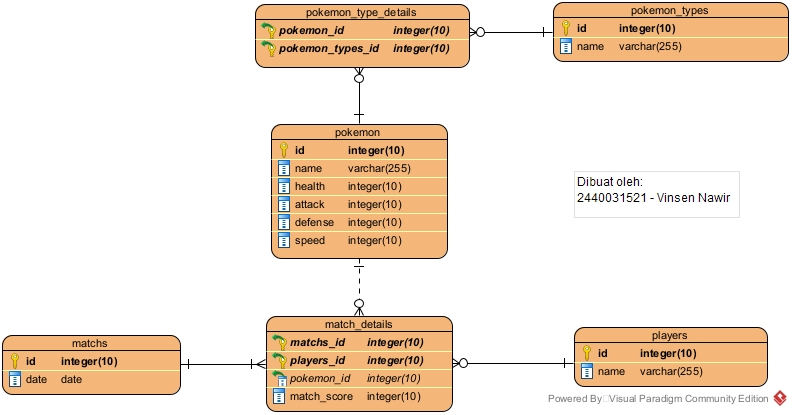

## Project Name
Pokemon Battle Royale Simulator

## Documentation Link
https://drive.google.com/drive/folders/1-X1npLNNvquIVQOYoE23AKanVuKTbOCs?usp=sharing

## Deployment (For Windows)
  * Open XAMPP and start Apache & MySQL
  * Clone project and move project folder inside htdocs (C:\xampp\htdocs)
  * Go to the folder application using cd command on your cmd
  * Run `composer install` to download all dependencies needed.
  * Run `copy .env.example .env`
  * Create new database named `pokemon-battle-royale` in phpmyadmin
  * Open .env file, using DB_CONNECTION MySQL, change database name (DB_DATABASE) into `pokemon-battle-royale` on `127.0.0.1:3306` with `root` username and no password. You can customize the ip address, port, database username or password based on your own machine setup.
  * Run  `php artisan key:generate` to prepare all important data.
  * Run `php artisan migrate` to create database table.
  * Run `php artisan serve` and access the webapp on localhost port 8000 (http://localhost:8000/).

## Authors
|              |
| :----------------------------------------------------------------------: |
|                    Vinsen Nawir                                          |
|                     2440031521                                           |

## Tools
- Bootstrap 5
- PHP 8.1.1
- Composer
- Laravel
- Apache
- XAMPP
- Visual Paradigm 16.3

## ERD Diagram

## Special Thanks
Dr. Robertus Nugroho Perwiro Atmojo, S.Kom., M.M.S.I, CSCA  
As mentor and lecturer

## Extra Detail

| Course                          | Class |
| :-----------------------------  | :---- |
| ISYS6169001 - Database Systems  | LG01  |
